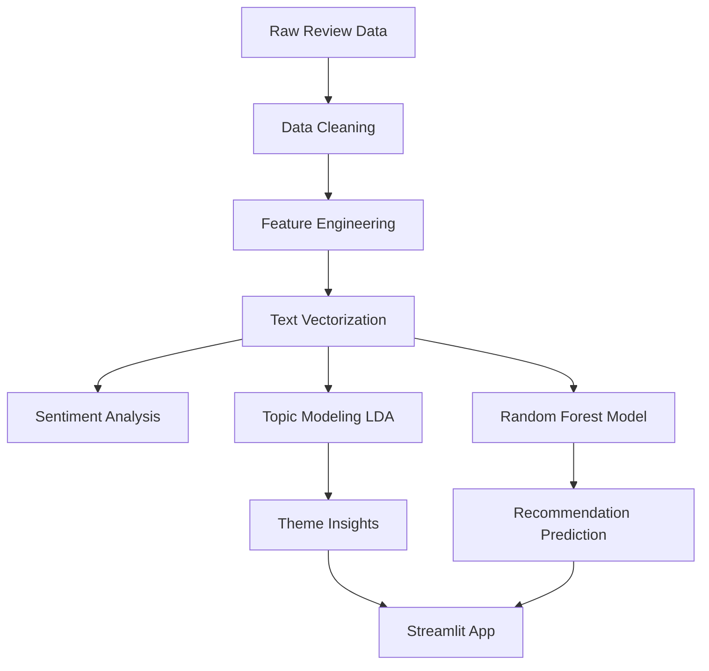
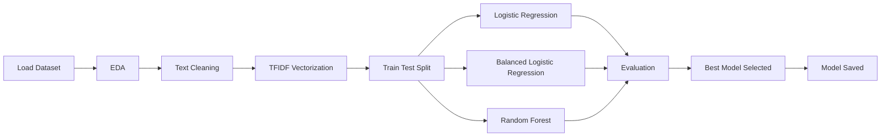
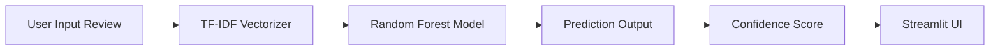

# 🚀 Customer Review Analytics & NLP Pipeline  
### End-to-End NLP • Machine Learning • Deployment System

<p align="center">      </p>

🎯 Business Problem

A leading women’s clothing e-commerce company wants to:
1. Understand customer behavior using review data
2. Identify drivers behind product recommendations
3. Discover key themes customers talk about
4. Predict whether a customer will recommend a product
5. Predict rating using textual feedback

This project builds a complete Analytics → NLP → ML → Deployment pipeline.

🧠 System Architecture
              



🔄 ML Pipeline Flow



🚀 Deployment Flow




📊 Exploratory Data Analysis

 1. Rating Distribution
 2. Age vs Rating
 3. Category Performance
 4. Channel Usage (Web vs Mobile)
 5. Location Analysis

💬 Sentiment & Word Cloud Analysis

Sentiment Derivation Logic

1. 4–5 → Positive
2. 3 → Neutral
3. 1–2 → Negative
   
Analysis Includes

1. Sentiment Distribution Visualization
2. Positive Review Word Cloud
3. Negative Review Word Cloud
4. Sentiment by Product Category
5. Sentiment by Customer Age Group
6. Topic Modeling (Unsupervised Learning)

Topic Modeling Approach

1. CountVectorizer
2. Latent Dirichlet Allocation (LDA)

Extracted dominant themes:

1. Fit & Size Issues
2. Fabric & Material Quality
3. Dress & Design Appeal
4. Comfort & Wearability
5. Color & Style Preferences

🤖 Predictive Modeling

 Recommendation Prediction
Models trained:
1. Logistic Regression (Baseline)
2. Balanced Logistic Regression (Class Weight Adjustment)
3. Random Forest Classifier

Final deployed model:
1. Random Forest + TF-IDF Vectorization

Model selection based on:
1. Higher accuracy
2. Better recall balance
3. Robust handling of class imbalance

⭐ Rating Prediction

Regression model implemented:
1. Linear Regression

Evaluation metrics:
1.Mean Absolute Error (MAE)
2. Mean Squared Error (MSE)

📈 Model Evaluation

System evaluated using:
1. Accuracy
2. Precision
3. Recall
4. F1 Score
5. Confusion Matrix
6. Mean Absolute Error (MAE)
7. Mean Squared Error (MSE)

🌐 Live Streamlit Application

The interactive dashboard provides:

1. Exploratory Data Analysis Visualizations
2. Word Cloud Analysis
3. Live Topic Distribution
4. Model Performance Dashboard
5. Real-Time Recommendation Prediction
6. Prediction Confidence Score

🏗 Project Structure


```
customer-review-nlp-pipeline/
│
├── app/
│   └── app.py
│
├── data/
│   └── Womens Clothing Reviews Data.xlsx
│
├── models/
│   ├── rf_model_text.pkl
│   ├── tfidf_vectorizer.pkl
│   ├── lda_model.pkl
│   └── count_vectorizer.pkl
│
├── notebooks/
│   └── main.ipynb
│
├── requirements.txt
└── README.md
```

 
🧩 Technology Stack

1. Language: Python
2. NLP: TF-IDF, CountVectorizer, LDA
3. Machine Learning: Logistic Regression, Random Forest
4. Visualization: Matplotlib, Seaborn
5. Deployment: Streamlit
6. Model Storage: Joblib

🚀 How to Run Locally

pip install -r requirements.txt
streamlit run app/app.py

🌟 Key Highlights

1. End-to-end NLP system
2. Supervised and unsupervised learning integration
3. Class imbalance handling
4. Real-time prediction pipeline
5. Interactive analytics dashboard
6. Clean modular project structure

🔮 Future Improvements

1. Batch CSV prediction upload
2. REST API integration using FastAPI
3. Docker containerization
4. Cloud deployment
5. Automated model retraining

📌 Executive Summary

This project transforms raw customer reviews into actionable business insights using Natural Language Processing and Machine Learning.

It integrates:

1. Exploratory Data Analysis
2. Sentiment & Theme Extraction
3. Predictive Modeling
4. Interactive Deployment

The system enables real-time recommendation prediction and structured customer insight discovery to support data-driven business decisions.


👩‍💻 Author

Pooja Prajapat

Machine Learning & Analytics Enthusiast
